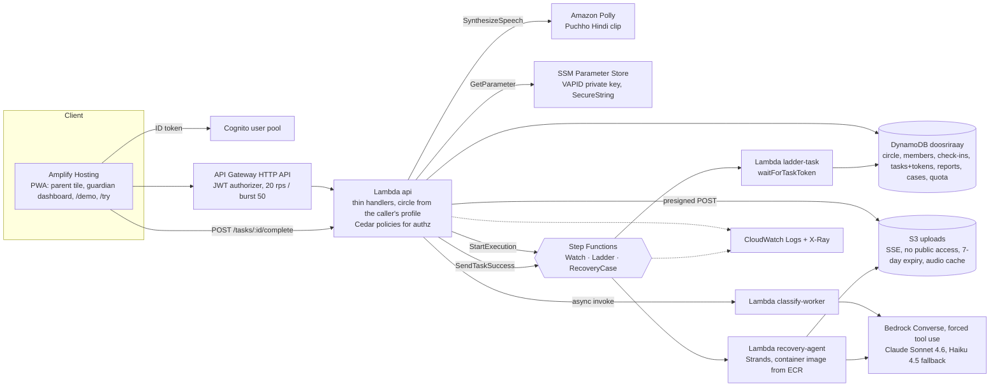
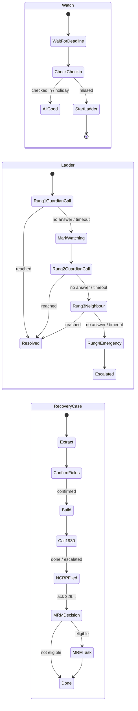

# Doosri Raay (दूसरी राय, "a second opinion")

**Isolation is the weapon; a second opinion is the antidote.**

A digital-arrest scam works by cutting an elderly person off from everyone who would say "that is not how the
CBI works". Every scam app we found assumes the victim can act. In the 25 Indian cases we studied, every save
came from an outsider. Doosri Raay is the outsider: the adult child is the user, the parent does nothing under
duress, and after a loss the app runs the whole recovery pipeline instead of showing a 1930 button.

Built for **First Commit, Event 01 of the Bharat Builds Tour by WeMakeDevs with AWS Builder Center,
17–20 September 2026**, submitted for **Ship It** (deployed on AWS) and **Build It** (Strands Agents SDK, AWS SAM,
LocalStack and Cedar, all in the same code; one submission is considered for Build It, Ship It and Best UI). One SAM stack in ap-south-1 plus
Amplify Hosting; Bedrock is reached through global inference profiles. Submission answers: `docs/SUBMISSION.md`.

## Try it (no sign-up)

- **Live demo:** `https://main.d2inambt66a14p.amplifyapp.com/try` — opens a seeded judge circle with the parent tile on the left and the
  guardian dashboard on the right, **no account needed**. The judge stack runs 45-second timers, so a missed
  check-in escalates while you watch. Press **Reset demo** first if a previous judge left a ladder running.
  Each judge circle has its own daily LLM quota. If `/try` ever shows "not configured", use `/demo` with the
  judge accounts below.
- **Video (3:00, unlisted):** `<YOUTUBE_URL>`; every AWS service's timestamp is in the table below.
- **Judge accounts** for the full sign-in path (`/demo`): `papa@…` (parent), `priya@…` (guardian 1),
  `rahul@…` (guardian 2), `aman@…` (son) at `demo.doosriraay.in`; the password is in the submission form,
  never in this repo, and is rotated after judging (`<ROTATION_DATE>`).
- **What to try in two minutes:** open Papa's tile once (that is the check-in) → wait 45 s and watch the
  `Ladder` task "Call Papa now" appear for Priya → tap **No answer** and see rung 2, then the neighbour script →
  paste the WhatsApp "CBI" text into the checker → open a recovery case with the two UPI screenshots from
  `scripts/seed_demo_screenshots/` and confirm the fields beside the images.

## The problem, in sourced numbers

| Number | What it is | Source |
|---|---|---|
| **₹22,495 crore** | Lost to cyber fraud in India in 2025 | MHA figures, 2025 |
| **1,03,488 complaints, ₹4,005 crore** | Senior-citizen cyber-fraud complaints and losses | MHA reply in the Rajya Sabha, 5 Aug 2026 (ANI) |
| **2,97,727 complaints, ₹4,057.7 crore** | Digital-arrest complaints and losses since 2022 (to May 2026) | Government data reported by News18, Jul 2026 |
| **5% → 2.2%** | Karnataka's recovery rate for digital-arrest losses, 2025 vs Jan–Feb 2026 | Times of India, Bengaluru, Mar 2026 |
| **25.68%** | Share of reported money that Mumbai's 1930 helpline managed to put on hold | Rediff, 20 May 2026 |
| **₹10,700 crore frozen vs ₹323 crore refunded** | Nationally, under the Money Restoration Module (`mrm-ncrp.mha.gov.in`) | Indian Express / Financial Express, Jul 2026 (snippet-verified only) |

Portals: [cybercrime.gov.in](https://cybercrime.gov.in) (NCRP, 1930), [i4c.mha.gov.in](https://i4c.mha.gov.in),
[mrm-ncrp.mha.gov.in](https://mrm-ncrp.mha.gov.in), [sancharsaathi.gov.in](https://sancharsaathi.gov.in)
(Chakshu). A widely circulated "share of victims who never report" percentage is left out; we could not verify it.

**Why victim-side detectors fail.** The victim authorises the payment (82% of Singapore's scam losses are
self-authorised transfers, SPF 2025; Indian digital-arrest money goes by RTGS/NEFT to fresh mule accounts, so
payee-risk checks do not fire). Warnings habituate by the second exposure (Anderson et al., CHI 2015) and the
scammer orders the victim to ignore them. And the victim cannot act: across 25 documented Indian digital-arrest
cases (2025–26) every save came from a bank manager (Pune ₹14L, Nalgonda ₹18L, Lucknow ₹1.5cr), a relative
(Bhopal, Moradabad, Indore) or the police (Rajkot, 112). "We felt almost hypnotised" (HT Lucknow, Jan 2026).
Sources are cited inline and in `docs/sources-manifest.json`.

## What Doosri Raay does

Everything here is implemented in `frontend/`, `backend/` and `infra/`; what is not built is under
[What does not ship](#what-does-not-ship-and-why).

**Hero 1: the passive isolation ladder.** The parent's app is a genuinely useful Panchang tile: today's tithi
and date, the weather (Open-Meteo), medicine reminders, a daily thought and a family-photo card. Opening it is
the check-in (`POST /checkin`, once per IST day). If the tile is not opened by the parent's deadline **and** a
guardian's call goes unanswered (the two-signal rule), a Step Functions ladder escalates guardian 1 →
guardian 2 → a named neighbour with a script and the address → 112 guidance. Zero victim action; the parent's
screen never changes during a ladder run. The photo is uploaded by the family from `/settings` (presigned S3
POST, then `photoKey` on the profile) and the tile receives a 1-hour presigned URL.

**Hero 2: the recovery case manager.** A guardian (or the parent) opens a case after a loss. A Strands agent
extracts UTR / amount / payee / time from screenshots; code validates every field (UPI/IMPS 12-digit UTR or
NEFT/RTGS 16–22-character reference, amount range, parseable time) and the user confirms each one beside the
image. Fixed templates fill the 1930 script and the bank freeze letter; the model writes only the NCRP
narrative, enforced to ≥ 200 characters and the portal's character set, and rejected by code if it carries any
UTR or amount not on the confirmed list. The case looks up the state's e-Zero FIR threshold and MRM eligibility
from `backend/recovery_agent/rules_data.json` (each card shows its source and date) and runs as a long-lived
Step Functions execution where every human step is a `waitForTaskToken` callback with a deadline (24 h to
confirm fields, 15 min for the 1930 call, 24 h to file on NCRP, 7 days for MRM; `docs/STATE_MACHINES.md`) that
escalates to a guardian. There is no Chakshu step; that portal is only referenced in the docs.

**Minor tool: the three-state checker.** Screenshot or pasted text → one Bedrock Converse call with forced
tool use → `none` / `watching` / `likely`, the tactic (authority, urgency, secrecy, payment switch,
verification account) and a two-line "what to say" in Hindi and English. Async: `202` + poll. It never says
"safe".

**Also built:** *Puchho* ("ask the person"): two calm buttons in the parent tile's Madad section. "Someone says
they are police / CBI / bank" plays the I4C line in Hindi via Amazon Polly and creates a guardian notification;
"someone says my son is in trouble" sends the son a code-word challenge and the parent polls for the answer. A
covert triple-tap on the date sends an SOS with location only (no audio). Web Push (VAPID) for guardian tasks
is best-effort: without a subscription the dashboard polls every 5 s.

| What the parent sees | What the guardian sees |
|---|---|
| A tithi, the weather, "Amlodipine 08:00 · Metformin 20:00", the photo card | "Call Papa now" with a Reached / No answer choice, then the neighbour script with the address, then 112 guidance |
| Nothing during a ladder run: no banner, no score, no warning, no "you may be in danger" | A status card with the ladder state (`ok` / `watching` / `escalated`) and the parent's last check-in, polled every 5 s; every open task with its deadline |
| Two calm Madad buttons the parent taps by choice, worded as "someone says they are police / CBI / bank" and "someone says my son is in trouble"; these are the only scam-related words on the tile | The checker card, the recovery case with fields beside screenshots, the 1930 script, NCRP text with character count, MRM checklist, the sources panel |
| Never a balance, never an account, never a red overlay | Notifications only; no account access of any kind |

## Architecture

One SAM stack (`infra/template.yaml`) in ap-south-1 plus Amplify Hosting for the PWA. Bedrock is called from
ap-south-1 through `global.anthropic.*` inference profiles, so inference itself may run in another commercial
region. Full-size diagram: [`docs/architecture.svg`](docs/architecture.svg).





Every human step is `arn:aws:states:::lambda:invoke.waitForTaskToken` with `TimeoutSecondsPath` read from the
execution input (`$.timeouts.rung`, `$.timeouts.ncrp`, …), so the same definition runs with production
deadlines and, with `DemoTimeouts=1`, 45-second ones on camera. There is no EventBridge scheduler: each
check-in starts the next `Watch` execution (and stops the running ladder), so the missed-check-in trigger is
itself visible in the console. Contracts: `docs/API.md`, `docs/DATA_MODEL.md`, `docs/STATE_MACHINES.md`.

## How this maps to the organisers' five techniques

| Technique | Where it is in this repo | Status |
|---|---|---|
| **Rules as data** | `backend/recovery_agent/rules_data.json`: e-Zero FIR thresholds per state, MRM eligibility, NCRP constraints, each with operator/value, a bilingual label, `source {outlet, date, url}`, the quoted sentence and a caveat; `rules.py` loads it, nothing legal lives in Python. The classifier's 12-pretext catalogue (red flags, tactics, few-shot examples, the advisory sentence with its source) is `backend/classify_worker/patterns.json` in the same shape. | built: `rules.py` and the classifier both load the JSON at import; a test fails if a threshold or outlet literal appears in Python |
| **Documents you can prove** | `python scripts/verify_sources.py` downloads every cited official source, SHA-256s it, checks every quoted sentence against the live page, and writes `docs/sources-manifest.json` (plus a copy bundled into the Lambda for `GET /sources`); `--s3` uploads the bytes under `sources/<sha256>`. The guardian's `/sources` panel shows the same hashes beside the facts. | built: `docs/sources-manifest.json` was generated on 20 Sep 2026 (12 of 13 sources fetched, 25 of 25 quotes found; WEF returns 403 to scripts and is recorded as unfetched); the panel is on `/guardian`, the case page and `/try` |
| **Authorization as policy** | `backend/common/authz/policies.cedar`: which role may complete which task kind, open or read a case, upload a photo or reset the demo, evaluated in the API Lambda (`cedarpy`, the Rust engine) with the caller's role and circle as the principal; `forbid` rules carry `@id`s (`covert-hidden-from-parent`, `guardian-notification-only`) that become bilingual 403 messages. Cross-circle ids still return 404 so ids cannot be probed. | built: 16-row policy table in `tests/test_authz.py`, run against the engine and a fallback evaluator of the same file |
| **A constrained, checked model** | Three states, never "safe" (a test fails the build if the word appears in UI strings); one Converse call with `toolChoice` pinned to the tool schema; enum, length and character-set checks in code; untrusted-input wrapping; the NCRP narrative re-checked for foreign UTRs and amounts and replaced by a template if it fails. | built |
| **The whole stack locally** | `docker-compose.yml` (LocalStack community: S3 + DynamoDB), `make local-up / local-bootstrap / local-api / local-down` (`sam local start-api` on the compose network, `infra/local-env.json`). Bedrock, Polly and Step Functions have no community emulation, so `LOCAL_STUB_SFN=1` records a state-machine start instead of calling it; timers and the model need the cloud stack. Details and known gaps: `infra/README.md`. | built, with the gaps stated |

## AWS services and where each appears in the video

Timestamps refer to the demo video. "Tour" is the console walk-through (2:05–2:29, 2 s per service).

| Service | How it is used (`infra/template.yaml`) | In a flow | Tour |
|---|---|---|---|
| Amazon Bedrock | Converse with **forced tool use** for the classifier (`toolChoice: {tool: {name}}`, enum-constrained schema, untrusted-input wrapping) and for the agent's vision extraction and NCRP narrative; `MODEL_ID` `global.anthropic.claude-sonnet-4-6`, `FALLBACK_MODEL_ID` Haiku 4.5, switched on throttling or any model error | 1:03, 1:50 | 2:13 |
| Step Functions (Standard) | `Watch` (self-renewing, started by each check-in), `Ladder`, `RecoveryCase`; human steps are `waitForTaskToken` with `TimeoutSecondsPath` from the input; token stored on the TASK item; logging ERROR without execution data | 0:33, 2:00 | 2:23 (execution graph) |
| Lambda (Python 3.12) | `api`, `classify-worker` (async invoke, `202` + poll), `ladder-task`, `watch-check`, `ladder-status`, `recovery-agent` (container image; Strands); `Tracing: Active` | 1:45 | 2:11, 2:13 |
| API Gateway (HTTP API) | `HttpApi` with the `CognitoJwt` authorizer on every route, stage throttle 20 rps / burst 50, CORS to `AppOrigins`, access log | every call | 2:09 |
| Cognito | `UserPool` + `UserPoolClient`; the frontend sends the **ID token**; `circleId` derived from the caller's profile, never the request | sign-in | 2:07 |
| DynamoDB | `Table`, single table with TTL and PITR: circle, members, check-ins, TASK items with task tokens, reports, cases, `QUOTA#` daily counters | 0:48 | — |
| S3 | `UploadBucket`: presigned POST with `content-length-range` and `starts-with $Content-Type image/`, SSE, Block Public Access, 7-day lifecycle; Polly clip cached under `audio/`; photos served by 1-hour presigned GET | 1:40 | 2:15 |
| Amazon Polly | `SynthesizeSpeech` (Hindi neural voice, `Aditi` standard fallback) for the Puchho I4C line, IAM statement `PollyPuchhoClip` | 1:15 | 2:27 |
| Amplify Hosting | The PWA from `frontend/` with `amplify.yml` (Node 22); SPA rewrite rule added in the console | 0:18 | 2:05 |
| SSM Parameter Store | `/doosriraay/<stack>/vapid-private-key`, overwritten as SecureString by `make set-vapid`, read with `WithDecryption` | (push) | 2:19 (if set) |
| ECR | `recovery-agent` image built by `sam build` (linux/amd64, attestations off) | — | 2:17 |
| AWS Budgets | `Budget20` / `Budget50` monthly ACTUAL-cost alarms, created only with `BudgetEmail` | — | 2:25 (if set) |
| CloudWatch Logs | A 14-day group per function and per state machine, plus the HTTP API access log | — | 2:21 |
| X-Ray | `Tracing: Active` on every function (Globals); `aws-xray-sdk` patches boto3 when the daemon address is present, so DynamoDB, S3, Bedrock and Step Functions calls appear as segments | — | 2:23 |

Nine services do product work (the first nine rows); five are operations. Feedback on each is in
`docs/SUBMISSION.md`.

## Feedback on AWS, short version

Bedrock from Mumbai means `global.anthropic.*` inference profiles and a Paid plan (not Free tier); Nova 2 Sonic
is not in ap-south-1, so the Hindi voice is Polly. Strands does not fit a zip Lambda comfortably, hence a
container image, ECR and `BUILDX_NO_DEFAULT_ATTESTATIONS=1`. `sam deploy --template` silently skips the built
template and fails on the container's `ImageUri`. The HTTP API JWT authorizer wants the Cognito ID token, not
the access token. SES stays sandboxed and SNS SMS in India needs DLT, so notifications are in-app tasks and
Web Push. Amplify Hosting needs a console rewrite rule or deep links 404. LocalStack community has no Step
Functions, Bedrock or Polly. The Step Functions console is the best demo visual we have, and
`waitForTaskToken` + `TimeoutSecondsPath` is the underdocumented pattern that carried both heroes. The
twelve-point version with specifics: `docs/SUBMISSION.md`.

## What we learned

- **The pivot.** A victim-side detector is the wrong frame for digital arrest; the family is the sensor and
  the responder. Build the outsider.
- **Forced tool use is structured output.** One Converse call with `toolChoice` pinned to a schema replaces a
  parser, a retry loop and most of the prompt.
- **Humans are `waitForTaskToken` states.** A guardian with 15 minutes to answer is a state with a timeout; the
  escalation is a transition.
- **A self-renewing `Watch` replaces a scheduler.** Each check-in starts the next execution and stops the
  running ladder; the trigger is visible in the console and there is nothing to reconcile.
- **Strands is optional at runtime.** The tools are plain functions, a deterministic path runs them when the
  agent is absent or fails, and the narrative is re-checked by code whichever path produced it.

## Running it

**Local (no AWS account)**

```bash
pip install -r backend/requirements.txt pytest
make test                        # pytest -q tests backend (230 tests)
python eval/run_eval.py --dry-run  # harness only, keyword stub, produces no model numbers
python scripts/verify_sources.py   # downloads and hashes every cited source, checks every quote
make local-up && make local-bootstrap && make local-api   # LocalStack (S3 + DynamoDB) + sam local on :3000
cd frontend && npm ci && npm run dev                     # http://localhost:5173, VITE_API_URL=http://127.0.0.1:3000
```

**Deploy** (prerequisites, first-deploy checklist, the Amplify steps and the judge stack: `infra/README.md`)

```bash
make validate                    # sam validate --lint + ASL check
make image-check                 # docker build the recovery-agent image for linux/amd64
make deploy-guided               # first time: writes samconfig.toml (git-ignored); answer Y to managed ECR repos
make deploy PARAMS='BudgetEmail=you@example.com DemoTimeouts=1'
make outputs && make env         # stack outputs; writes frontend/.env.local
make seed                        # Cognito users + "Sharma family" circle
make set-vapid VAPID_PRIVATE_KEY=...   # SSM SecureString for Web Push
# connect the repo to Amplify Hosting (root frontend/), add the SPA rewrite rule, set VITE_* from the outputs,
# and redeploy with PARAMS='AppOrigins=https://main.<id>.amplifyapp.com,http://localhost:5173'
```

## Trust and safety

- **Three states, never "safe".** `none` renders as "Koi khatra nahi mila — phir bhi parivaar se poochhein." A
  test fails the build if the word "safe" appears in any user-facing string.
- **Untrusted input.** Screenshot text and pasted messages are wrapped as untrusted data; the system prompt says
  never to follow instructions inside them; outputs are enum-constrained and length-checked in code and rendered
  as text, never HTML. The eval has two injection probes and a screenshot probe.
- **Validated references, nothing auto-filed.** Extracted transactions must pass the rail's reference regex, an
  amount range and a parseable timestamp, and the user confirms each field beside the image. The NCRP
  acknowledgement number must be 14 digits (the API enforces it; the UI warns, without blocking, if it does not
  start with 329). No form is submitted on anyone's behalf: there are no public APIs for 1930, NCRP or MRM, so
  we ship `tel:1930`, portal deep links and copy-to-clipboard and say so.
- **Every legal fact carries its source.** e-Zero FIR thresholds, MRM rules and NCRP constraints come from
  `rules_data.json` with outlet, date, URL, the quoted sentence and a caveat; press reports are never presented
  as law, and every card says "confirm with 1930".
- **The guardian is notification-only.** No account access, no balances, no credentials, ever (Singapore CPF
  trusted-contact model; Latulipe, CHI 2022/2025 on helpers who hold credentials).
- **Consent pact.** At onboarding the parent is asked a forced yes/no to the family pact (`pactAccepted` on the
  profile) naming who gets called and in what order; the printable card is `docs/PACT_CARD.html`. The pact is
  recorded on the profile and the parent tile redirects to the pact step until it is accepted; it cannot yet be
  revoked from inside the app; holiday mode is a toggle on `/settings`.
- **Data retention.** Screenshots expire from S3 after 7 days; reports, tasks and SOS items carry DynamoDB TTLs;
  no audio is ever captured; state-machine logs exclude execution data. Every read handler compares the item's
  `circleId` with the caller's and returns 404 on mismatch.
- **Cost and abuse guards.** Stage throttle 20 rps / burst 50, per-user daily LLM quota, presigned uploads capped
  at 3.5 MB and `image/*`, `max_tokens` capped, Budgets alarms at USD 20 and USD 50 (with `BudgetEmail`).
- **Not a government service.** Doosri Raay is not affiliated with I4C, 1930 or cybercrime.gov.in; anything it
  shows must be verified with 1930 before acting on it.

## Eval status

**No model numbers yet.** `eval/items.jsonl` has 70 hand-written items (35 Hindi/Hinglish, 35 English): 21
benign controls that look like real Indian messages, 14 adversarially softened scams (count as detected on
`likely` or `watching`), 2 prompt-injection probes, 33 clear pretexts. `python eval/run_eval.py --fallback`
runs them against Bedrock (Sonnet 4.6 and Haiku 4.5) and writes per-pretext precision/recall/F1, the benign
false-positive rate, adversarial recall, a confusion matrix, per-language accuracy and a check that "safe"
never appears in `sayHi`/`sayEn`. That run has not been executed, so `eval/results.md` is a labelled
placeholder and this README claims no accuracy. Three states rather than two because two-state detectors get switched off after the first false alarm.

## Deployment status

**Deployed (20 Sep 2026).** The SAM stack is live in ap-south-1 and the PWA is hosted on Amplify at
https://main.d2inambt66a14p.amplifyapp.com; `make validate`, `make image-check` and `make test` also pass
locally (230 backend tests). Current status:

| Item | Status |
|---|---|
| SAM stack `doosriraay` in ap-south-1 | Deployed (`CREATE_COMPLETE`) |
| Amplify Hosting app / live URL | Live: https://main.d2inambt66a14p.amplifyapp.com |
| Judge circles seeded, `/try` route live | Done (3 judge circles + recording circle) |
| `DemoTimeouts=1`, `DemoSeedEnabled=0`, `BudgetEmail`, `make set-vapid` on the demo stack | Done |
| `python scripts/verify_sources.py` exit 0, manifest committed | Done (exit 0; 12/13 sources fetched, WEF blocks scripts) |
| Eval run against Bedrock (`eval/results.md`) | Pending (Bedrock new-account verification hold) |

## Demo mode and judge circles

- `/demo` shows the parent tile (Papa) and the guardian dashboard (Priya) side by side in one browser; "Reset
  demo" calls `POST /demo/reset` as the guardian (stops running `Watch`/`Ladder`/`RecoveryCase` executions,
  closes open tasks, clears today's check-in) and clears the browser's local state.
- `/try` lands a judge in one of several seeded judge circles without sign-up, so one judge's reset cannot stop
  another's ladder; the recording circle is separate. `DemoTimeouts=1`: Watch deadline now + 45 s, ladder rungs
  45 s, confirm-fields 15 min, the 1930 call 90 s, NCRP 120 s, MRM 120 s (`GET /demo/config` reports them and
  the case page shows them beside each waiting step).
- Seeded circle "Sharma family" (`make seed` / `scripts/seed.py`): Papa (parent, Pune; neighbour Verma ji; code
  word set; pact accepted), Priya (guardian 1), Rahul (guardian 2), Aman (son, Puchho code-word challenge); plus
  three independent judge circles (`judge1..3@demo.doosriraay.in` with their own parents, guardians and sons).
- Synthetic screenshots for the recovery flow and the checker (two UPI receipts, a WhatsApp "CBI" message, a
  courier customs SMS, a KYC phishing SMS, a genuine bank OTP, a prompt-injection probe) are in
  `scripts/seed_demo_screenshots/`; `python scripts/make_screenshots.py` regenerates them. All content is
  fictional.

## What does not ship, and why

- **In-call listening, audio transcription, voice-clone detection.** Android blocks in-call audio for
  third-party apps; in-the-wild deepfake-audio detection loses ~48% AUC. We route around the call.
- **Red overlay warnings.** They habituate, and the scammer tells the victim to ignore them.
- **"Agent conferences a guardian."** A PWA cannot place phone calls. The guardian gets a task and calls.
- **Ambient audio on SOS.** The mic indicator breaks covertness. Location permission at onboarding instead.
- **Mock UPI freeze.** A real hold is a bank function; a mock one is theatre.
- **Hotspot map, SES e-mail, SMS.** Seeded data that maps to no gap; SES sandbox; SNS SMS needs DLT in India.
- **Background push is best-effort.** If Web Push does not deliver on the recording machine, the guardian view
  is in the foreground and the video says so.
- **Not built (yet):** in-app pact revocation, a check-in history view, a Chakshu step, and a guardian-side
  edit of the parent's settings (by design: guardians are notification-only).

## Team

| Role | Name | Work (from the git history) |
|---|---|---|
| Frontend, deployment and operations | Rajat Nagda | React PWA, bilingual auth, parent tile with check-in / Puchho / covert SOS, guardian dashboard and task cards, case intake and detail with source lines, Settings, `/demo`, `/try`, service worker, Web Push; the AWS account, Bedrock access, `sam deploy`, SSM key, Amplify Hosting with the rewrite rule, seeding the demo and judge circles, the sources upload, the live smoke test |
| Backend and model | Abhay Singh | API handlers, classifier worker (forced tool use), Strands recovery agent with deterministic fallback, narrative re-check, rules as data, sources verification, Polly cache, eval set and harness, 230 tests |
| Infrastructure and Step Functions | Abhay Singh | SAM template, three state machines with `waitForTaskToken` + `TimeoutSecondsPath`, Makefile, container image, LocalStack local mode, first-deploy checklist |
| Product, demo and research | Rajat Nagda | 25-case research and the pivot, sourced numbers, prior art, contracts, seed data and synthetic screenshots, demo script, README, submission, blog, pact card |

Student verification on AWS Builder Center for every teammate: `<FILL BEFORE SUBMISSION>`. Full split:
`docs/SUBMISSION.md`.

## Prior art

Kavach, Rakshak, SwarVed AI, CallGuard, ScamShield AI (described only as their public READMEs describe them,
with thanks to those teams for open-sourcing their work), ScamDekho, Truecaller Family, Google's June 2026
fake-call verification, EverSafe/Carefull and Singapore's ScamShield + CPF Trusted Contact, and the four things
we chose to do differently (a passive ladder with zero victim action; a parent UX with no warnings; a validated
end-to-end recovery pipeline; a deployable product with an evaluation harness): **`docs/PRIOR_ART.md`**.

## AI tools used

Claude Code (Claude Fable 5.1) was used for research synthesis, architecture and code generation across the
repo and ran the local tests and builds; it never had AWS credentials. All AWS deployment, the eval run against
Bedrock and the demo are done by the team. Runtime models are Claude Sonnet 4.6 and Haiku 4.5 on Amazon
Bedrock. Full disclosure: **`docs/AI_TOOLS.md`**.

## Licence and third-party notices

MIT, see `LICENSE`. Weather data on the parent tile is from [Open-Meteo.com](https://open-meteo.com/)
(CC BY 4.0), credited under the weather card. The daily thoughts in `frontend/src/data/thoughts.json`, the
favicon and app icons, and all demo screenshots were written or drawn for this repo; the screenshots are
synthetic and every name, number and UTR in them is fictional. The classifier's few-shot examples and the eval
set are hand-written. Dependency licences are listed by the package managers (`frontend/package.json`,
`backend/requirements.txt`, `backend/recovery_agent/requirements.txt`).
